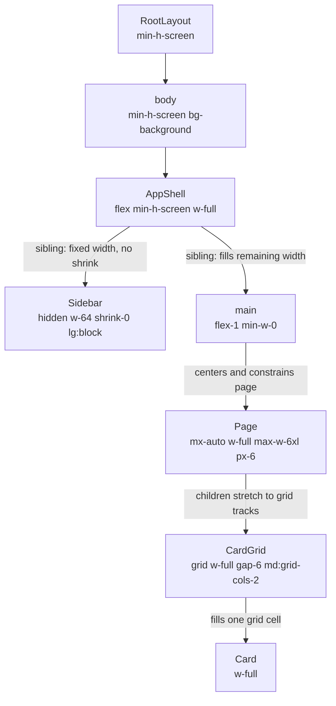

# Design System

Use this with the shadcn/ui skill. Do not duplicate shadcn docs; first use shadcn project context for component APIs, then apply these Turbostart rules.

## Entry point

For a new app, ask whether the design should be bootstrapped from `shadcn/create` before hand-writing theme tokens.

Useful commands:

```bash
bunx shadcn@latest create          # visually choose base, colors, radius, fonts, icons
bunx shadcn@latest apply <preset>  # apply generated preset to an existing app
bunx shadcn@latest info --json     # inspect current shadcn setup
```

## Foundations

- Use shadcn semantic tokens: `background`, `foreground`, `card`, `primary`, `secondary`, `muted`, `accent`, `destructive`, `border`, `input`, `ring`, and their `*-foreground` pairs.
- Prefer token utilities like `bg-background`, `text-foreground`, `bg-card`, `text-muted-foreground`, `border-border`, `ring-ring`.
- Avoid raw hex colors, one-off color scales, and arbitrary spacing/sizing/typography unless there is a clear reason.
- Keep new foundations minimal. Name a spacing, section, or typography pattern only after it appears reusable.
- Design mobile-first: define the smallest-screen layout first, then add `sm:`, `md:`, `lg:`, and `xl:` changes upward only when the design needs them.
- Treat responsive behavior, including responsive typography, as part of the component contract, not a later polish step.

## Component placement

- `src/components/ui/*`: shadcn primitives only.
- `src/components/*`: shared shell components such as sidebar, nav, header, providers.
- `src/features/{domain}/*`: reusable product UI for one domain.
- `src/app/**/_components/*`: route-private UI.
- `src/app/**/page.tsx`: thin composition only.
- One primary named component per file. Split sibling cards, panels, forms, and layout-owning sections into dedicated files instead of putting multiple reusable components in one file.

## Layout primitives

Prefer simple, repeated layout primitives before inventing custom abstractions:

- Page shell: `min-h-screen bg-background text-foreground`.
- Main area: `flex-1 min-w-0`.
- Page content: `container` or `mx-auto w-full max-w-*` with consistent `px-* py-*`.
- Sections: vertical rhythm with `space-y-*` or `grid gap-*`.
- Cards/panels: `rounded-lg border bg-card text-card-foreground shadow-sm`.
- Muted supporting text: `text-sm text-muted-foreground`.

## Typography

Use typography roles, not one-off font sizes. Start with Tailwind's default type scale and responsive variants before adding custom values.

Use mobile-first typography: the base class is the smallest-screen style, and breakpoint classes scale upward. Use responsive typography mostly for headings and display text. Body, supporting, and metadata text usually stay the same size across breakpoints for readability and consistency.

Common patterns:

| Role | Default pattern | Responsive rule |
| --- | --- | --- |
| Marketing hero title | `text-4xl font-semibold tracking-tight text-balance md:text-6xl` | Large visual type scales up on desktop and down on mobile. |
| Page title / `h1` | `text-2xl font-semibold tracking-tight md:text-3xl` | Page headers are smaller on mobile, larger on desktop. |
| Section title / `h2` | `text-xl font-semibold tracking-tight md:text-2xl` | Use when the section is a major page region. |
| Subsection title / `h3` | `text-lg font-medium tracking-tight` | Usually stable across breakpoints. |
| Card title | `text-base font-medium` or shadcn `CardTitle` default | Usually stable; the card/container should adapt first. |
| Body text | `text-sm leading-6 text-foreground` | Usually stable across breakpoints. |
| Supporting text | `text-sm leading-5 text-muted-foreground` | Usually stable across breakpoints. |
| Metadata / labels | `text-xs text-muted-foreground` | Usually stable across breakpoints. |

If text feels too large or breaks on a small screen, do not jump to `text-[13px]`, `leading-[17px]`, or fixed pixel widths. First choose the correct role, add a breakpoint only when the role should visually scale (`text-2xl md:text-3xl`), constrain reading width with `max-w-*`, and decide whether long content should wrap (`text-pretty`, `break-words`), balance (`text-balance`), truncate (`truncate`), or scroll inside an `overflow-auto` parent.

Create named typography components or variants only after the same role appears in multiple places.

## Mermaid component tree

When a change affects app shell, route layout, page structure, major reusable components, or responsive grid/flex behavior, update `docs/design-system/component-tree.md`.

The diagram exists to debug layout inheritance from top to bottom. Document the Tailwind classes that decide parent/child geometry: `flex`, `grid`, `contents`, `items-*`, `justify-*`, `place-*`, `self-*`, `w-*`, `min-w-*`, `max-w-*`, `h-*`, `min-h-*`, `grow`, `shrink`, `basis-*`, `overflow-*`, `container`, `mx-auto`, and responsive variants.

Do not document visual-only classes such as color, shadow, border radius, typography, or tiny internal spacing unless they change layout hierarchy.

Always include a short legend below the Mermaid diagram for the Tailwind layout utilities used in that diagram. Keep it outside the diagram so it does not distract from the visual component tree. Use a table with `Utility`, `Meaning`, and `Layout example` columns.



Legend:

| Utility | Meaning | Layout example |
| --- | --- | --- |
| `flex` | Children become flex items; row by default. | `AppShell` puts `Sidebar` and `Main` next to each other. |
| `flex-1` | Take remaining space; can grow and shrink. | `Main` fills all width not used by `Sidebar`. |
| `min-w-0` | Allow a flex/grid child to be narrower than long content; pair with wrap, truncate, or scroll rules inside. | `Main` does not force the whole page wider because a card title/table/code block is long. |
| `w-full` | Fill parent width. | `Page` fills `Main`; `Card` fills its grid cell. |
| `max-w-*` | Cap width so content stops expanding. | `Page` stops at `max-w-6xl` on large screens. |
| `mx-auto` | Center block when width is constrained. | `Page` is centered inside `Main`. |
| `shrink-0` | Keep fixed size when siblings compete for space. | `Sidebar` does not collapse. |
| `grid` / `grid-cols-*` | Parent defines child columns. | `CardGrid` decides whether cards are one column or two columns. |

## Review checklist

Before finishing frontend work:

1. shadcn primitives are reused before custom UI is added.
2. Tailwind classes use semantic tokens instead of hard-coded colors.
3. Typography uses role-based default scale classes before arbitrary values.
4. Spacing and sizing follow an existing pattern or introduce a clearly reusable one.
5. Responsive classes are mobile-first: base style works on the smallest screen, then breakpoints enhance upward.
6. Component placement matches the Turbostart folder rules.
7. Reusable or layout-owning named components live in dedicated files.
8. Mermaid component tree is updated if layout structure changed.
