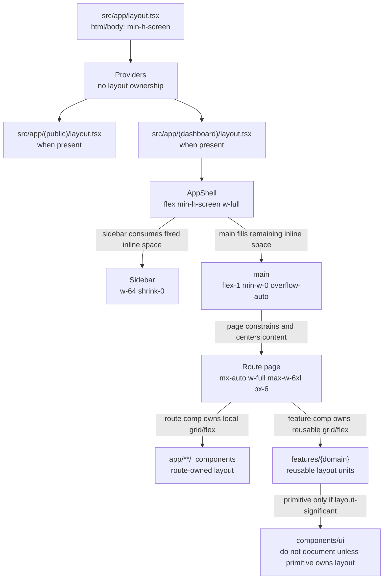

# Component Tree

This diagram documents layout inheritance from top to bottom. Use it to answer questions like: why is this child centered, why is it full width, why is it constrained, or which parent owns the grid/flex behavior?

Include only components that affect parent/child geometry. Put layout-defining Tailwind classes directly in the node label and add edge labels when the relationship explains sizing or alignment.

Track classes such as `flex`, `grid`, `items-*`, `justify-*`, `place-*`, `self-*`, `w-*`, `min-w-*`, `max-w-*`, `h-*`, `min-h-*`, `grow`, `shrink`, `basis-*`, `overflow-*`, `container`, `mx-auto`, and responsive variants. Skip visual-only styling.

Update this file when layout structure, sizing ownership, alignment ownership, or responsive behavior changes. Keep the footnote legend below the diagram in sync with the utilities shown in the diagram.

## Layout utility legend

| Utility | Meaning | Layout example |
| --- | --- | --- |
| `flex` | Children become flex items; row by default. | `AppShell` puts `Sidebar` and `Main` next to each other. |
| `flex-1` | Take remaining space; can grow and shrink. | `Main` fills all width not used by `Sidebar`. |
| `min-w-0` | Allow a flex/grid child to be narrower than long content; pair with wrap, truncate, or scroll rules inside. | `Main` does not force the whole page wider because a card title/table/code block is long. |
| `w-full` | Fill parent width. | `Page` fills `Main`; `Card` fills its grid cell. |
| `w-64` | Fixed width from the Tailwind spacing scale. | `Sidebar` stays `16rem` wide. |
| `max-w-*` | Cap width so content stops expanding. | `Page` can fill small screens but stops at `max-w-6xl` on large screens. |
| `mx-auto` | Center block when width is constrained. | `Page` is centered inside `Main` after `max-w-6xl` caps its width. |
| `shrink-0` | Keep fixed size when siblings compete for space. | `Sidebar` does not collapse when `Main` has wide content. |
| `min-h-screen` | At least viewport height. | `AppShell` covers the full browser height even with little content. |
| `overflow-auto` | Scroll when content exceeds the box. | `Main` scrolls instead of making the whole shell wider/taller. |
| `grid` / `grid-cols-*` | Parent defines child columns. | `CardGrid` decides whether cards are one column or two columns. |
| `items-*` | Cross-axis alignment in flex/grid. | `items-center` vertically centers children in a row flex container. |
| `justify-*` | Main-axis alignment in flex; inline-axis in grid. | `justify-between` pushes header title left and actions right. |
